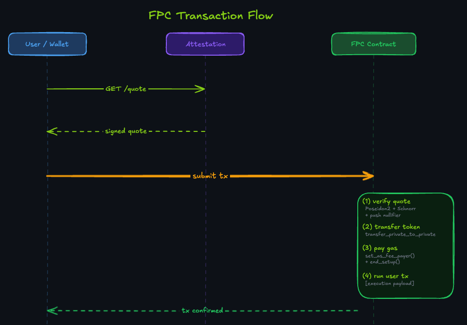

# Aztec FPC

## TLDR

FPC (Fee Payment Contract) is an Aztec primitive: a smart contract that pays Fee Juice on a user's behalf. The protocol supports three FPC designs (sponsored, private, third-party-token) and doesn't dictate what the operator receives in return.

Nethermind's `aztec-fpc` is one such implementation: a **private, multi-asset, quote-based FPC** deployed on testnet. Users pay the operator in any accepted token, at a rate locked by an operator-signed Schnorr quote. One contract instance serves any number of tokens; new tokens are added via the attestation service without redeploying.

## Components

| Component | Role |
|-----------|------|
| **[FPC Contract](https://github.com/NethermindEth/aztec-fpc/blob/main/contracts/fpc/src/main.nr)** (`FPCMultiAsset`) | On-chain fee payer. Verifies operator-signed quotes, transfers tokens from user to operator, pays Fee Juice to the protocol. |
| **[Attestation Service](https://github.com/NethermindEth/aztec-fpc/blob/main/services/attestation/src/server.ts)** | REST API that signs per-user fee quotes with the operator's Schnorr key. Serves wallet discovery metadata at `/.well-known/fpc.json`. |
| **[Top-up Service](https://github.com/NethermindEth/aztec-fpc/blob/main/services/topup/src/index.ts)** | Monitors the FPC's Fee Juice balance on L2 and bridges more from L1 when it drops below a threshold. |
| **[SDK](https://github.com/NethermindEth/aztec-fpc/blob/main/sdk/src/payment-method.ts)** (`@nethermindeth/aztec-fpc-sdk`) | TypeScript client that handles quote fetching, auth-witness construction, and transaction submission. |

| | |
|---|---|
| **Tokens accepted** | Any operator-accepted token (added via the admin API, no redeployment) |
| **Cold-start** | 1 tx from L1 bridge to active L2 account |
| **On-chain allowlist** | None required (quote-binding enforces asset selection) |
| **SDK surface** | 2 methods |

[GitHub](https://github.com/NethermindEth/aztec-fpc) | [SDK Getting Started](sdk.md) | [Testnet Deployment](./reference/testnet-deployment.md)

---

## What is FPC?

Every Aztec transaction requires Fee Juice, the protocol's native fee token. Fee Juice is non-transferable on L2 and must be bridged from L1 or paid on a user's behalf by another contract.

FPC is the Aztec pattern for the second option: a smart contract that holds Fee Juice and pays it for the user. The protocol doesn't prescribe what (if anything) the operator receives back. Existing FPC designs include:

- **Sponsored FPC**: pays unconditionally for free transactions (testnet, devnet, local networks only)
- **Private FPC**: routes fee payments through private notes so fee activity stays off the public state
- **Third-party token FPCs**: accept a specific token in exchange for covering the Fee Juice cost

## What `aztec-fpc` is

Nethermind's `aztec-fpc` is a **private, multi-asset, quote-based FPC** deployed on testnet. Three properties define it:

- **Multi-asset**: one contract instance serves any number of accepted tokens. The asset is selected per-quote, not hard-coded at deploy time. New tokens are added through the attestation service's admin API without redeploying.
- **Private**: fee payments move as private notes via `transfer_private_to_private`. Fee activity is not visible in public state. (Exception: the cold-start path calls `mint_to_private`, which enqueues a public `increase_total_supply_internal` call, so the minted amount is visible even though the user's identity and balances remain private.)
- **Quote-based**: an operator-run attestation service signs per-user quotes binding the FPC address, accepted asset, payment amount, Fee Juice amount, expiry, and user address. The on-chain contract verifies the Schnorr signature before executing the transfer.

A **cold-start entrypoint** lets a brand-new account bridge tokens from L1, claim on L2, and pay the fee in one transaction.

The operator holds Fee Juice (auto-topped-up from L1 by the top-up service), sets pricing via a configurable `fee_bips` spread in the attestation service, and keeps the margin.

### How a standard transaction works



The wallet requests a quote from the attestation service, which prices the Fee Juice cost in the user's token and signs it with the operator's Schnorr key. The user includes the operator's quote signature in their transaction alongside a transfer authorization witness (authwit). The authwit authorizes the token transfer and is carried as an execution payload component, not a function argument to `fee_entrypoint`.

The FPC contract then:

1. Reconstructs the quote hash via `compute_inner_authwit_hash` over the 7-field preimage (domain separator, FPC address, accepted asset, Fee Juice amount, payment amount, expiry, user address)
2. Verifies the Schnorr signature against the stored operator public key
3. Pushes a nullifier to prevent replay
4. Calls `transfer_private_to_private` to move the payment from user to operator
5. Calls `set_as_fee_payer()` and `end_setup()`, committing the fee before the user's app logic runs

All of this executes in the setup phase.

### What `aztec-fpc` does not do

It does not eliminate fee costs. It shifts who pays them and in what token. The operator takes on the operational cost of keeping the FPC funded with Fee Juice and recoups it through a configurable spread per token. The spread is set as `fee_bips` in the attestation service configuration and is applied off-chain when pricing quotes. The on-chain contract has no knowledge of `fee_bips`. It verifies and settles whatever signed amounts the attestation service produced.

Quote signatures are user-specific and single-use. A quote issued to one user cannot be used by another, and a consumed quote cannot be replayed. The operator is not exposed to a free-rider problem, but they are exposed to market rate risk if the token value moves between quote issuance and settlement.

There is no on-chain asset allowlist. The contract does not enforce which tokens are accepted. Protection comes entirely from the quote signature: `accepted_asset` is part of the signed `compute_inner_authwit_hash` preimage, so substituting a different token at call time invalidates the signature.

Operator key rotation requires deploying a new contract. The public key is stored in `PublicImmutable` and cannot be updated.

### Comparison with Aztec's Sponsored FPC

Aztec Labs ships a [Sponsored FPC](https://docs.aztec.network/developers/docs/aztec-js/how_to_pay_fees) for development and testing only. It is available on testnet, devnet, and local networks, not on mainnet. It is a pure subsidy run by Aztec Labs with no payment mechanism, no operator revenue, no cold-start, and no off-chain services.

Nethermind's `aztec-fpc` is the production-oriented variant. The operator runs it, accepts payment in any operator-accepted token via Schnorr-signed single-use quotes, earns a configurable `fee_bips` spread, and supports cold-start onboarding from L1 via `cold_start_entrypoint`.

---

## Quick Example

```typescript
import { FpcClient } from "@nethermindeth/aztec-fpc-sdk";

// Standard flow: user already holds an operator-accepted token on L2
const { fee } = await fpcClient.createPaymentMethod({
  wallet,
  user: userAddress,
  tokenAddress,
  estimatedGas,
});
await contract.methods.transfer(recipient, amount).send({ fee });

// Cold-start: user just bridged an operator-accepted token from L1 to L2
const result = await fpcClient.executeColdStart({
  wallet,
  userAddress,
  tokenAddress,
  bridgeAddress,
  bridgeClaim,
});
```

---

## Start Here

| You are... | Goal | Start here |
|---|---|---|
| **dApp developer** | Use an existing FPC operator or run your own | [SDK Getting Started](sdk.md) |
| **Wallet team / operator** | Deploy the contract, configure attestation, surface FPC in your wallet | [Testnet Deployment](./reference/testnet-deployment.md) |
| **Bridge / onboarding UX** | Claim bridged tokens, pay fees, deliver the remainder in one atomic tx | [SDK Getting Started](sdk.md#cold-start-flow-user-just-bridged-from-l1) |
| **Auditor** | Quote binding, setup-phase irreversibility, replay protection, operator key custody | [Security](./security.md) |

> [!TIP]
> **Wallet teams running their own FPC** combine the operator and integrator roles. Start with the [SDK Getting Started](sdk.md), then follow the [Run an Operator](./how-to/run-operator.md) guide to deploy and fund your own instance.

---

## Documentation

| Section | Pages |
|---|---|
| **Overview** | [Architecture](architecture.md), [Quote System](quote-system.md), [Security](security.md), [Quick Start](quick-start.md) |
| **SDK** | [Getting Started](sdk.md), [API Reference](sdk.md#api-reference) |
| **Contracts** | [Overview](contracts.md), [FPCMultiAsset](https://github.com/NethermindEth/aztec-fpc/blob/main/contracts/fpc/README.md), [Faucet](https://github.com/NethermindEth/aztec-fpc/blob/main/contracts/faucet/README.md), [Token Bridge](https://github.com/NethermindEth/aztec-fpc/blob/main/contracts/token_bridge/src/main.nr) |
| **Services** | [Attestation](services.md), [Top-up](services.md#top-up-service) |
| **How-to** | [Run an Operator](./how-to/run-operator.md), [Integrate Wallet](./how-to/integrate-wallet.md), [Add Supported Asset](./how-to/add-supported-asset.md), [Cold-Start Flow](./how-to/cold-start-flow.md) |
| **Operations** | [Configuration](./operations/configuration.md), [Deployment](./operations/deployment.md), [Docker](./operations/docker.md), [Testing](./operations/testing.md) |
| **Reference** | [Metrics](./reference/metrics.md), [E2E Test Matrix](./reference/e2e-test-matrix.md), [Testnet Deployment](./reference/testnet-deployment.md), [Wallet Discovery](./reference/wallet-discovery.md), [Asset Model ADR](https://github.com/NethermindEth/aztec-fpc/blob/main/docs/specs/spec/adr-0001-alpha-asset-model.md) |

---

## Contributing to Docs

After editing any `.md` file in `docs/`, regenerate the LLM index:

```bash
bash scripts/generate-llms-full.sh
```

Commit the updated `docs/public/llms-full.txt` alongside your changes. The `docs-freshness` CI check will fail if it's stale.

When adding a new page: create the `.md` file, add it to the `FILES=()` array in `scripts/generate-llms-full.sh`, add it to the documentation table above, and add it to `docs/public/llms.txt`.

Testnet addresses live in one place: `docs/reference/testnet-deployment.md`. All other pages reference it.

## Get Help

- **Email:** [aayush@nethermind.io](mailto:aayush@nethermind.io)
- **GitHub Discussions:** [NethermindEth/aztec-fpc discussions](https://github.com/NethermindEth/aztec-fpc/discussions)
- **Bug reports:** [Open an issue](https://github.com/NethermindEth/aztec-fpc/issues/new)

For Aztec protocol questions (not specific to this FPC implementation), see the [Aztec docs](https://docs.aztec.network/) and [Aztec Discord](https://discord.gg/aztec).

---

*Aztec FPC, Nethermind, Apache-2.0*
