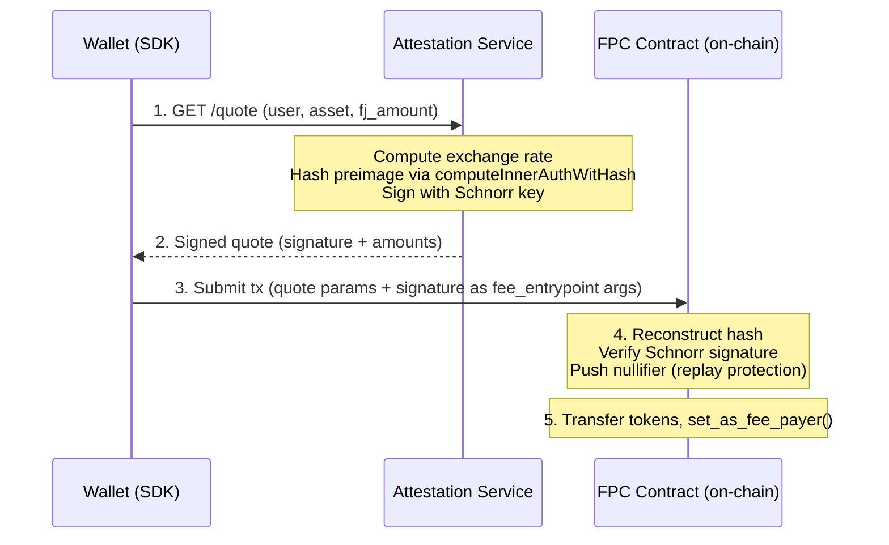

# Quote System

A fee quote is a signed commitment from the operator: "I will accept `aa_payment_amount` of `accepted_asset` in exchange for paying `fj_fee_amount` of Fee Juice for this user's transaction, valid until `valid_until`."

Exchange rates are fixed by the operator per accepted token in the asset policy store (`market_rate_num / market_rate_den`) and updated manually via the admin API. There is no on-chain oracle and no live price feed. The operator carries market-rate risk between updates.

The attestation service signs these off-chain. The FPC contract verifies them on-chain.

> [!NOTE]
> This page covers the on-chain verification format and signing details. For an integration overview, start with [SDK Getting Started](sdk.md). For the security model, see [Security](security.md).

> [!NOTE]
> **Quote signature vs token transfer authwit**
>
> The quote signature commits the operator to specific pricing terms. It is not an authwit. Separately, the user provides an authwit authorizing the FPC to transfer `aa_payment_amount` to the operator. The contract reuses Aztec stdlib's `compute_inner_authwit_hash` (a domain-separated Poseidon hash) to hash the quote preimage, but this is only a hash utility choice. The quote is a Schnorr-signed commitment, not an authwit.

## Source files

- Contract verification: [`contracts/fpc/src/main.nr`](https://github.com/NethermindEth/aztec-fpc/blob/main/contracts/fpc/src/main.nr#L252) (`assert_valid_quote`, `assert_valid_cold_start_quote`)
- Quote signing: [`services/attestation/src/signer.ts`](https://github.com/NethermindEth/aztec-fpc/blob/main/services/attestation/src/signer.ts#L88)
- Exchange rate: [`services/attestation/src/config.ts`](https://github.com/NethermindEth/aztec-fpc/blob/main/services/attestation/src/config.ts#L572) (`computeFinalRate`)

## Lifecycle



The wallet calls `GET /quote?user=&accepted_asset=&fj_amount=`. The service computes the rate, hashes the preimage with `computeInnerAuthWitHash` from `@aztec/stdlib/auth-witness`, signs the 32-byte hash with the operator's Schnorr key, and returns a 64-byte hex signature.

The user passes the quote arguments and signature to `fee_entrypoint`. A separate token-transfer authwit (authorizing the FPC to pull `aa_payment_amount` from the user) is carried in `authWitnesses`, not as a function argument.

The contract reconstructs the hash, verifies the signature against the immutable operator pubkey, and pushes the quote hash as a nullifier. The nullifier prevents reuse. The contract then transfers tokens and calls `set_as_fee_payer()`.

For `fee_entrypoint`, `fj_amount` must equal `get_max_gas_cost` for the transaction's gas settings.

## Quote types

### Normal quote (`fee_entrypoint`)

| Property | Value |
|---|---|
| Domain separator | `0x465043` (ASCII: `FPC`) |
| Hash function | `compute_inner_authwit_hash` |
| Signature | Schnorr (64 bytes) |
| Preimage fields | 7: domain separator, FPC address, `accepted_asset`, `fj_fee_amount`, `aa_payment_amount`, `valid_until`, `user_address` (`msg_sender`, never zero) |

Source: [`assert_valid_quote` in `contracts/fpc/src/main.nr`](https://github.com/NethermindEth/aztec-fpc/blob/main/contracts/fpc/src/main.nr#L262-L270).

### Cold-start quote (`cold_start_entrypoint`)

| Property | Value |
|---|---|
| Domain separator | `0x46504373` (ASCII: `FPCs`) |
| Hash function | `compute_inner_authwit_hash` |
| Signature | Schnorr (64 bytes) |
| Preimage fields | 9: the 7 fields above plus `claim_amount` and `claim_secret_hash`. `user_address` is an explicit param (not `msg_sender`). |

Source: [`assert_valid_cold_start_quote` in `contracts/fpc/src/main.nr`](https://github.com/NethermindEth/aztec-fpc/blob/main/contracts/fpc/src/main.nr#L300-L310).

> [!WARNING]
> `bridge` and `message_leaf_index` are accepted as function arguments but are **not** signed. Only `claim_amount` and `claim_secret_hash` bind the quote to a specific bridge deposit. The bridge address can be chosen by the caller at transaction time. The operator trusts the claim because the mint goes to the FPC first, and the contract only distributes what was actually claimed.

The different domain separators prevent cross-entrypoint quote reuse. A quote signed for `fee_entrypoint` will fail verification in `cold_start_entrypoint`, and vice versa.

## Exchange rate

Per-asset pricing comes from the asset policy store: `market_rate_num`, `market_rate_den`, `fee_bips`.

`aa_payment_amount = ceil(fj_amount × market_rate_num × (10000 + fee_bips) / (market_rate_den × 10000))`

Example with `market_rate_num=1`, `market_rate_den=1000`, `fee_bips=200` (2%): `fj_amount=1,000,000` → `aa_payment_amount = 1020`.

Implementation: [`computeFinalRate` in `services/attestation/src/config.ts`](https://github.com/NethermindEth/aztec-fpc/blob/main/services/attestation/src/config.ts#L572).

The on-chain contract has no knowledge of `fee_bips` or the rate values. It enforces the final `aa_payment_amount` as signed. Rate changes take effect at quote signing and need no contract interaction.

## Security properties

| Property | How it is enforced |
|----------|-------------------|
| **Authenticity** | Schnorr signature against immutable on-chain pubkey |
| **Integrity** | `compute_inner_authwit_hash` covers all parameters; any change breaks the signature |
| **Replay protection** | Quote hash pushed as nullifier; duplicates fail |
| **User binding** | Hash includes user address; one user's quote cannot be used by another |
| **Freshness** | `anchor_block_timestamp <= valid_until` |
| **TTL cap** | `(valid_until - anchor_block_timestamp) <= 3600` seconds |
| **Expiration enforcement** | `context.set_expiration_timestamp(valid_until)` blocks late inclusion |
| **Domain separation** | `0x465043` vs `0x46504373` per entrypoint |
| **Asset binding** | `accepted_asset` is in the signed preimage |

## Quote response

```json
{
    "accepted_asset": "0x...",
    "fj_amount": "1000000",
    "aa_payment_amount": "1020",
    "valid_until": "1700000300",
    "signature": "0x..."
}
```

Numeric fields are strings to preserve u128 / unix-timestamp precision in JSON. Cold-start adds `claim_amount` and `claim_secret_hash`. The service validates `claim_amount >= aa_payment_amount` before signing a cold-start quote.

Bad inputs return deterministic `400 BAD_REQUEST`.

## Next Steps

- [Contracts](./contracts.md) for the on-chain verification logic.
- [Security Model](./security.md) for the full threat matrix.
- [SDK](./sdk.md) for how the SDK fetches quotes and constructs `FeePaymentMethod`.
