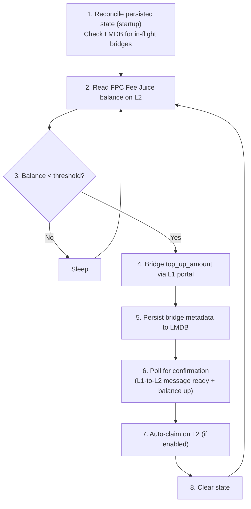

# Services

Two off-chain services run alongside the FPC contract: the attestation service (quote signing) and the top-up service (Fee Juice bridging).

> [!NOTE]
> This page is the high-level overview. For full endpoint specs, request/response shapes, startup sequences, and module-level detail, see the source-folder READMEs: [`services/attestation/README.md`](https://github.com/NethermindEth/aztec-fpc/blob/main/services/attestation/README.md) and [`services/topup/README.md`](https://github.com/NethermindEth/aztec-fpc/blob/main/services/topup/README.md). For setup, see [Run an Operator](./how-to/run-operator.md). For config keys, see [Configuration](./operations/configuration.md).

**On this page:**
[Service Map](#service-map) | [Attestation](#attestation-service) | [Top-up](#top-up-service) | [Operational Flow](#operational-flow) | [Authentication](#authentication) | [Ops Endpoints](#ops-endpoints)

---

## Service Map

| Service | Purpose | Source | Details |
|---|---|---|---|
| **Attestation** | REST API. Signs per-user fee quotes with the operator's Schnorr key. Serves wallet discovery at `/.well-known/fpc.json`. Admin endpoints for asset registration and operator sweeps. | [`services/attestation/`](https://github.com/NethermindEth/aztec-fpc/tree/main/services/attestation) | [`services/attestation/README.md`](https://github.com/NethermindEth/aztec-fpc/blob/main/services/attestation/README.md) |
| **Top-up** | Background daemon. Monitors the FPC's Fee Juice balance on L2 and bridges from L1 when it drops below threshold. Persists in-flight bridge state to LMDB for crash recovery. | [`services/topup/`](https://github.com/NethermindEth/aztec-fpc/tree/main/services/topup) | [`services/topup/README.md`](https://github.com/NethermindEth/aztec-fpc/blob/main/services/topup/README.md) |

## Attestation Service

1. Receives quote requests from wallets and dApps.
2. Looks up the requested token's pricing policy in the asset policy store.
3. Computes the payment amount using the configured exchange rate and operator margin (`fee_bips`).
4. Signs the quote with the operator's Schnorr key. See [Quote System](./quote-system.md) for preimage and signing details.
5. Returns the signed quote for on-chain verification by `FPCMultiAsset`.

### HTTP endpoints

| Method | Path | Description |
|---|---|---|
| `GET` | `/.well-known/fpc.json` | Wallet discovery metadata. Schema: [Wallet Discovery](./reference/wallet-discovery.md) |
| `GET` | `/health` | Liveness probe |
| `GET` | `/metrics` | Prometheus metrics |
| `GET` | `/accepted-assets` | Supported tokens (address, name) |
| `GET` | `/quote` | Request a signed fee quote |
| `GET` | `/cold-start-quote` | Request a signed cold-start quote (adds `claim_amount`, `claim_secret_hash`) |
| `*` | `/admin/*` | Admin endpoints (asset policies, operator balances, sweeps). Disabled by default. |

Full request/response shapes: [`services/attestation/README.md`](https://github.com/NethermindEth/aztec-fpc/blob/main/services/attestation/README.md#endpoints).

## Top-up Service

The FPC contract needs Fee Juice to pay fees on behalf of users. Without it, all `fee_entrypoint` calls fail. The top-up service prevents that by polling the balance and bridging automatically.

1. Periodically reads the FPC's Fee Juice balance on L2.
2. When the balance drops below `threshold`, bridges `top_up_amount` from L1 via `L1FeeJuicePortalManager.bridgeTokensPublic(...)`.
3. Persists bridge metadata to LMDB for crash recovery.
4. Waits for L1-to-L2 message readiness, with a balance-delta fallback as the final confirmation signal.
5. Optionally auto-claims bridged tokens on L2.

### Operational Flow

Only one bridge runs at a time. An in-flight guard prevents concurrent bridges. Crash-recovery and 24-hour stale-bridge eviction behavior: [`services/topup/README.md`](https://github.com/NethermindEth/aztec-fpc/blob/main/services/topup/README.md#crash-recovery).

## Authentication

### Quote endpoint (`quote_auth_mode`)

| Mode | Description |
|---|---|
| `disabled` | No authentication. Dev only. Rejected when `runtime_profile: production`. |
| `api_key` | Require API key in header (default: `x-api-key`). |
| `trusted_header` | Trust a reverse-proxy-set header. |
| `api_key_or_trusted_header` | Accept either. |
| `api_key_and_trusted_header` | Require both (headers must differ). |

### Admin endpoints

Set `ADMIN_API_KEY` environment variable; presented in the `x-admin-api-key` header (constant-time compare). If unset, admin endpoints return `503`.

Optional fixed-window rate limiting on `/quote`. See [Configuration: Rate limiting](./operations/configuration.md#rate-limiting).

## Ops Endpoints

Both services expose `/health`, `/metrics`, and (top-up only) `/ready`.

| Service | Default port | Endpoints |
|---|---|---|
| Attestation | `3000` | `/health`, `/metrics` |
| Top-up | `3001` | `/health`, `/ready` (200=ready, 503=not), `/metrics` |

Prometheus metric names: [Metrics Reference](./reference/metrics.md).

## Next Steps

- [Run an FPC Operator](./how-to/run-operator.md) for production deployment, reverse proxy, and monitoring.
- [Add a Supported Asset](./how-to/add-supported-asset.md) to register new payment tokens at runtime.
- [Configuration Reference](./operations/configuration.md) for every config key and environment variable.
- [Quote System](./quote-system.md) for the signed quote format and on-chain verification.
